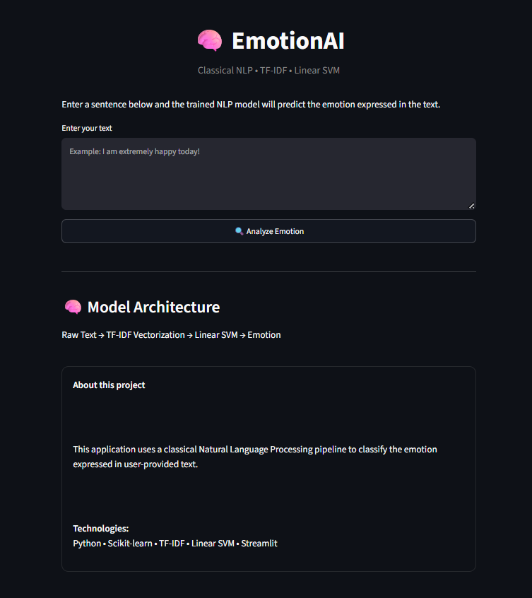
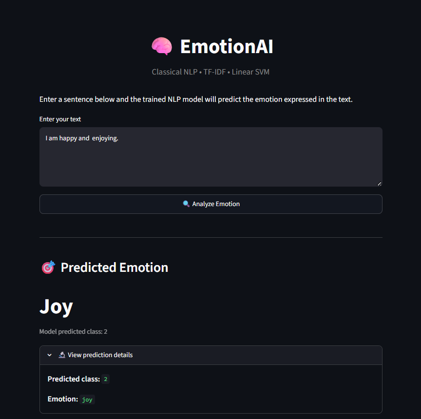
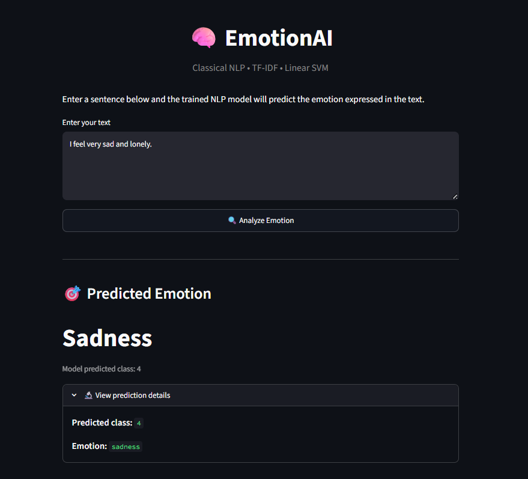

# 🧠 NLP Emotion Classification


<p align="center">
  <strong>A Classical Machine Learning NLP application for detecting emotions from natural language.</strong>
</p>

<p align="center">

  <a href="YOUR_STREAMLIT_URL">
    
  </a>

  
  
  
  
  
  

</p>

---

## 📌 Overview

**NLP Emotion Classification** is a classical Natural Language Processing project that
classifies human-written text into one of six emotion categories.

The project follows a complete machine learning workflow:

> **Raw Text → Text Preprocessing → TF-IDF → Machine Learning Classification → Emotion Prediction → Streamlit Deployment**

The application allows users to enter a sentence or short paragraph and receive an
instant emotion prediction through an interactive web interface.

### Supported Emotions

- 😠 Anger
- 😨 Fear
- 😄 Joy
- ❤️ Love
- 😢 Sadness
- 😲 Surprise

---

## 📸 Project Snapshots

<p align="center">
  
</p>

<p align="center">
  <strong>Interactive NLP Emotion Classification Dashboard</strong>
</p>

<br>

<p align="center">
  
</p>

<p align="center">
  <strong>Example: Joy Emotion Prediction</strong>
</p>

<br>

<p align="center">
  
</p>

<p align="center">
  <strong>Example: Sadness Emotion Prediction</strong>
</p>

---


## 🎯 Project Objective

The primary objective of this project is to build an end-to-end **classical NLP
classification system** capable of identifying the emotional intent expressed in
natural language.

Rather than using deep learning or transformer-based architectures, this project
focuses on understanding and implementing the fundamentals of classical NLP:

- Text preprocessing
- Label encoding
- Bag-of-Words representation
- TF-IDF feature extraction
- Multinomial Naive Bayes
- Logistic Regression
- Linear SVM
- Model evaluation
- Model serialization
- Streamlit deployment

This makes the project particularly useful for understanding the foundations of
NLP before moving toward deep learning and transformer-based approaches.

---

## 🧠 Machine Learning Pipeline

```text
                 INPUT TEXT
                     │
                     ▼
             Text Preprocessing
                     │
                     ▼
              TF-IDF Vectorizer
                     │
                     ▼
               Linear SVM
                     │
                     ▼
             Numeric Prediction
                     │
                     ▼
              Label Encoder
                     │
                     ▼
             Emotion Prediction
